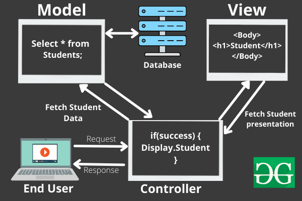
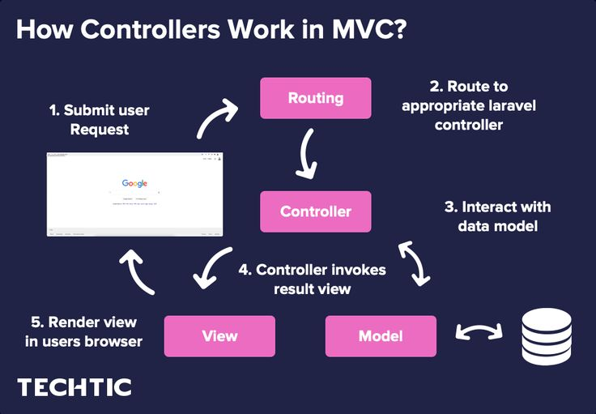
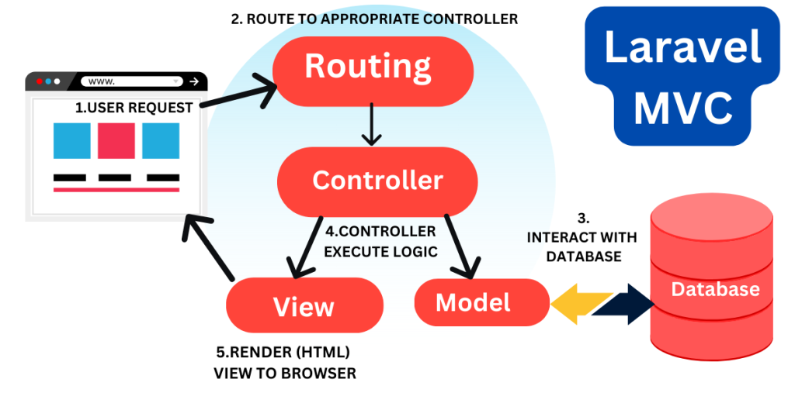

# MVC-DOCUMENTATION

Thanks for visiting my GitHub account!

### What is MVC?

**The Model-View-Controller (MVC)** framework is an architectural/design pattern that separates an application into three main logical components Model, View, and Controller. Each architectural component is built to handle specific development aspects of an application. It isolates the business logic and presentation layer from each other. It was traditionally used for desktop graphical user interfaces (GUIs). Nowadays, MVC is one of the most frequently used industry-standard web development frameworks to create scalable and extensible projects. It is also used for designing mobile apps.

MVC was created by Trygve Reenskaug. The main goal of this design pattern was to solve the problem of users controlling a large and complex data set by splitting a large application into specific sections that all have their own purpose.View [see-more](https://www.geeksforgeeks.org/mvc-framework-introduction/)

## CODE-EXAMPLE

- [Laravel](https://github.com/learnwithfair/laravel-restaurant)
- [MERN](https://github.com/learnwithfair/mern-ecommerce-electro-master)

## Source Code (Download)

[Click Here](https://mega.nz/folder/RGFiUApD#PoKIVCwF8IkQhE2PHw1XxQ)

## Features of MVC :

- It provides a clear separation of business logic, UI logic, and input logic.
- It offers full control over your HTML and URLs which makes it easy to design web application architecture.
- It is a powerful URL-mapping component using which we can build applications that have comprehensible and searchable URLs.
- It supports Test Driven Development (TDD).
- To know more about the benefits of using the MVC Framework refer to the article – Benefits of using MVC framework

## Components of MVC :

The MVC framework includes the following 3 components:

- Controller
- Model
- View

|                               |
| :---------------------------: |
|  |

### Controller:

The controller is the component that enables the interconnection between the views and the model so it acts as an intermediary. The controller doesn’t have to worry about handling data logic, it just tells the model what to do. It processes all the business logic and incoming requests, manipulates data using the Model component, and interact with the View to render the final output.

### View:

The View component is used for all the UI logic of the application. It generates a user interface for the user. Views are created by the data which is collected by the model component but these data aren’t taken directly but through the controller. It only interacts with the controller.

### Model:

The Model component corresponds to all the data-related logic that the user works with. This can represent either the data that is being transferred between the View and Controller components or any other business logic-related data. It can add or retrieve data from the database. It responds to the controller’s request because the controller can’t interact with the database by itself. The model interacts with the database and gives the required data back to the controller.

## Advantages of MVC:

- Codes are easy to maintain and they can be extended easily.
- The MVC model component can be tested separately.
- The components of MVC can be developed simultaneously.
- It reduces complexity by dividing an application into three units. Model, view, and controller.
- It supports Test Driven Development (TDD).
- It works well for Web apps that are supported by large teams of web designers and developers.
- This architecture helps to test components independently as all classes and objects are independent of each other
- Search Engine Optimization (SEO) Friendly.

## Disadvantages of MVC:

- It is difficult to read, change, test, and reuse this model
- It is not suitable for building small applications.
- The inefficiency of data access in view.
- The framework navigation can be complex as it introduces new layers of abstraction which requires users to adapt to the decomposition criteria of MVC.
- Increased complexity and Inefficiency of data

## Popular MVC Frameworks:

Some of the most popular and extensively used MVC frameworks are listed below.

- Ruby on Rails
- Django
- CherryPy
- Spring MVC
- Catalyst
- Rails
- Zend Framework
- Fuel PHP
- Laravel
- Symphony

**MVC is generally used on applications that run on a single graphical workstation. The division of logical components enables readability and modularity as well as it makes it more comfortable for the testing part.**

## Working of the MVC framework with an example:

Let’s imagine an end-user sends a request to a server to get a list of students studying in a class. The server would then send that request to that particular controller that handles students. That controller would then request the model that handles students to return a list of all students studying in a class.

|                               |                                          |
| :---------------------------: | :--------------------------------------: |
|            Model-1            |                 Model-2                  |
|  |  |

The model would query the database for the list of all students and then return that list back to the controller. If the response back from the model was successful, then the controller would ask the view associated with students to return a presentation of the list of students. This view would take the list of students from the controller and render the list into HTML that can be used by the browser.

The controller would then take that presentation and returns it back to the user. Thus ending the request. If earlier the model returned an error, the controller would handle that error by asking the view that handles errors to render a presentation for that particular error. That error presentation would then be returned to the user instead of the student list presentation.

As we can see from the above example, the model handles all of the data. The view handles all of the presentations and the controller just tells the model and view of what to do. This is the basic architecture and working of the MVC framework.

### The MVC architectural pattern allows us to adhere to the following design principles:

1. Divide and conquer. The three components can be somewhat independently designed.
2. Increase cohesion. The components have stronger layer cohesion than if the view and controller were together in a single UI layer.
3. Reduce coupling. The communication channels between the three components are minimal and easy to find.
4. Increase reuse. The view and controller normally make extensive use of reusable components for various kinds of UI controls. The UI, however, will become application-specific, therefore it will not be easily reusable.
5. Design for flexibility. It is usually quite easy to change the UI by changing the view, the controller, or both.

## MVC-STRUCTURE

|                                     |
| :---------------------------------: |
|                 MVC                 |
|  |

## Follow Me

 [Facebook](http://facebook.com/learnwithfair),  [Youtube](http://youtube.com/@learnwithfair),  [Instagram](http://instagram.com/learnwithfair)
